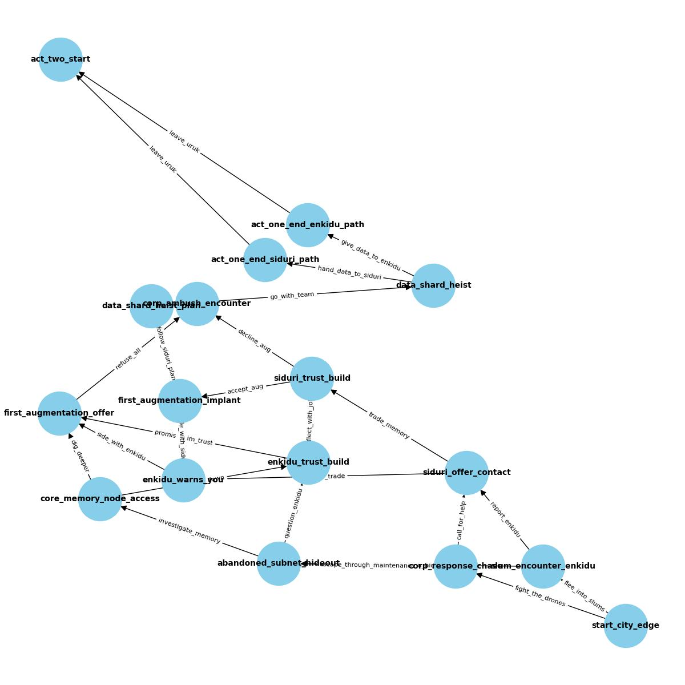
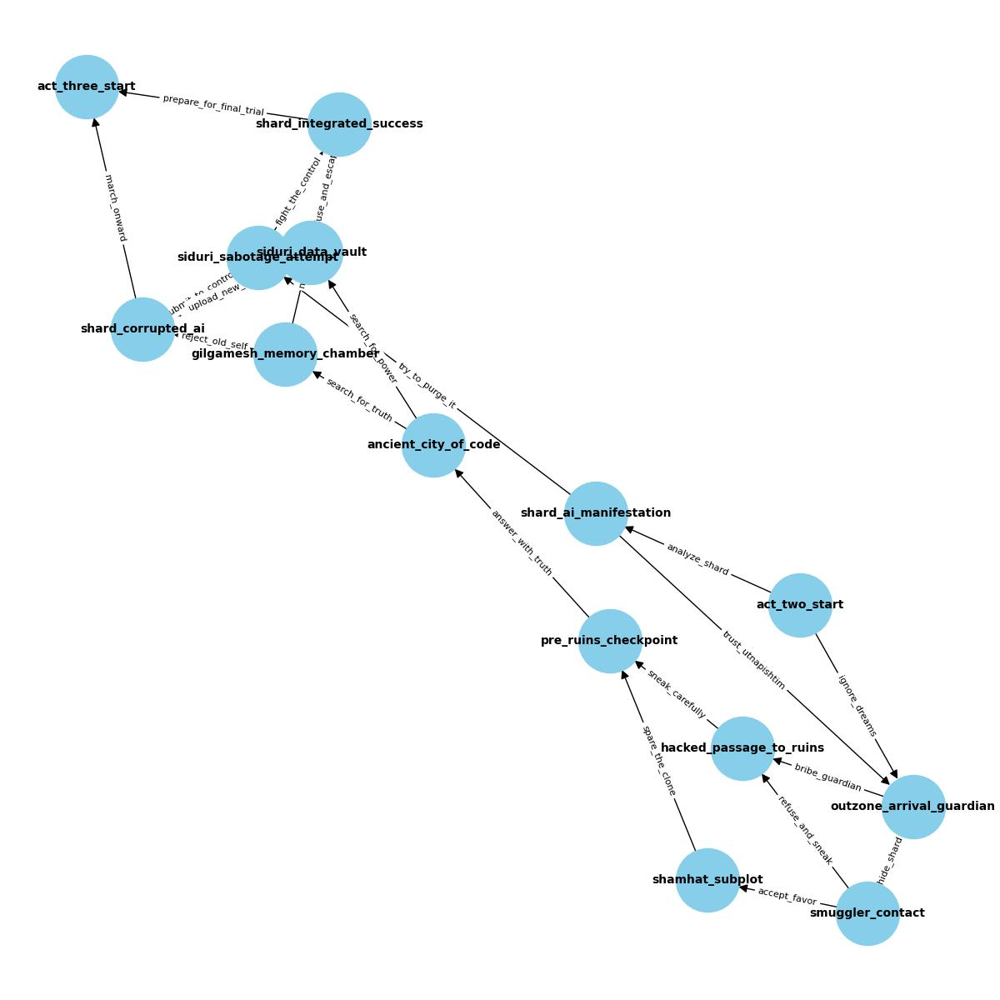
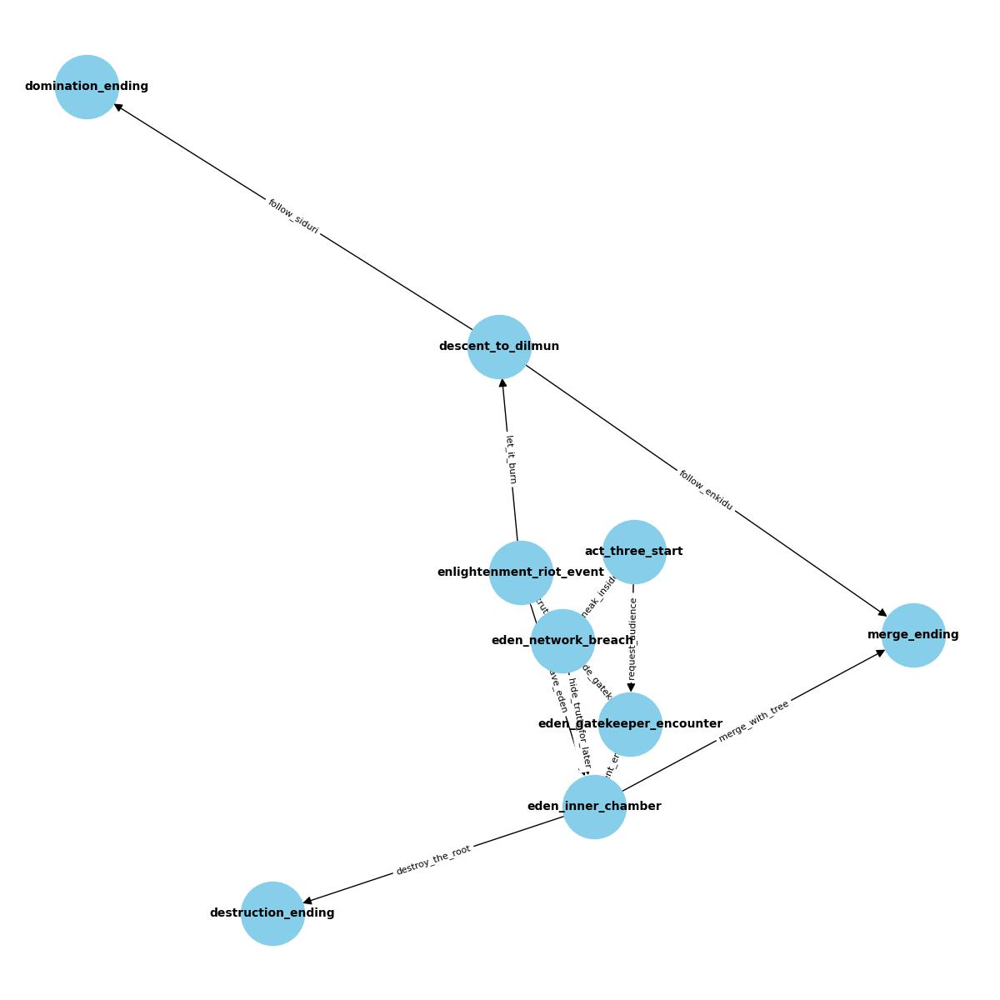

## Gilgamesh.exe: A Cyberpunk Retelling of the Epic of Gilgamesh CYOA game on Polkadot—your choices logged on-chain, your legend forged in blockchain-tracked history.

# Overview

*Gilgamesh.exe* is a choose-your-own-adventure (CYOA) game set in a cyberpunk reimagining of the *Epic of Gilgamesh*. The game uses blockchain technology to record each player’s decisions on-chain, creating an immutable and verifiable narrative history. While the full integration of blockchain features is still in development, the vision is to have a persistent and player-owned story experience where every decision has lasting impact.

# What *Gilgamesh.exe* Solves

Many narrative games fail to provide permanence or ownership of player choices. Decisions are often lost when the game ends, and there’s no way for players to prove or preserve their unique paths. *Gilgamesh.exe* solves this by storing player choices on-chain, ensuring they remain visible, verifiable, and immutable.

- **Immutable Decision Tracking:** Player choices will be recorded on-chain, allowing for a transparent, tamper-proof history of each unique journey.
- **NFT-Based Rewards:** Players will be able to mint NFTs representing rare story paths or endings. These NFTs will serve as proof of the player's choices, collectibles, or even keys to additional content in future games.
- **Decentralized Save System:** Progress will be tracked on-chain, making it portable, censorship-resistant, and available to players on demand.
- **Interoperability Across Web3:** Player actions and narrative outcomes will be usable in other decentralized applications, DAOs, or games, extending the game’s impact and ecosystem integration.

# How Polkadot Was Used to Achieve It

- **Remix + Solidity Smart Contracts:** The gameplay logic—including tracking decisions, managing story progress, and minting NFTs—is being developed in Solidity using Remix IDE. These contracts will eventually be deployed to a Polkadot-compatible EVM layer for execution.
- **Asset Hub for NFT Integration:** NFTs representing unique player paths will be issued using Polkadot's Asset Hub functionality, ensuring they’re seamlessly integrated into the Polkadot ecosystem and are available for low-cost, on-chain transactions.
- **Cross-Parachain Potential:** While the current game state is primarily localized, the design is built with Polkadot’s cross-chain messaging (XCMP) in mind. This will allow future expansion to integrate the game with other parachains or decentralized applications.
- **Immutable Story Graph (Future Work):** The concept for an immutable story graph that records each decision on-chain is under development. This structure will allow players to navigate and prove their narrative paths, making each playthrough an enduring part of blockchain history.

# Future Development

- **Blockchain Integration:** The smart contracts, immutable story graph, and NFT integration are still under development. The project is designed to scale and evolve with the growth of the Polkadot ecosystem.
- **NFT Minting:** Player paths will be minted as NFTs in future versions, allowing players to collect and trade unique story outcomes.
- **Cross-Chain Expansion:** Plans to expand the game into multiple parachains or integrate with other Web3 projects are being explored, enabling a broader narrative experience.

# Diagrams of the game map







# Demo game functionality

Demo game functionality (iteration 0): https://youtu.be/t5Ntn5ekXFA

Demo value save functionality with MetaMask on Westend AssetHub using Storage Smart contract (iteration 2): https://youtu.be/egZqN9xHS_g

# How to run

To run any of the iterationn:

- If the iteration runs on html and javascript then you use the command ```python -m http.server``` in the directory then navigate to ```localhost:8000```
- If the iteration runs on python create a virtual environment, observe any imported packages and install using pip then run the relevant app using ```python app.py```

# Presentation

Canva slides available here: https://www.canva.com/design/DAGlG4syXqw/I1lQla71YWCy2bIoX7OqeA/view?utm_content=DAGlG4syXqw&utm_campaign=designshare&utm_medium=link2&utm_source=uniquelinks&utlId=h31ff5951f8
